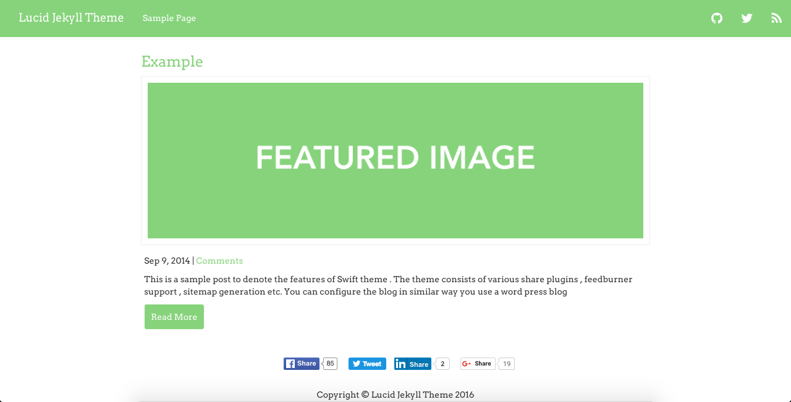
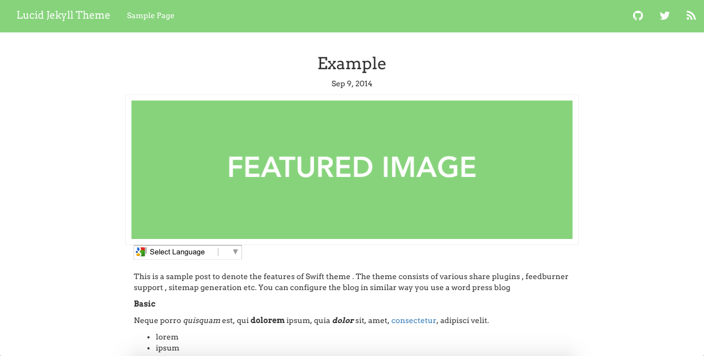
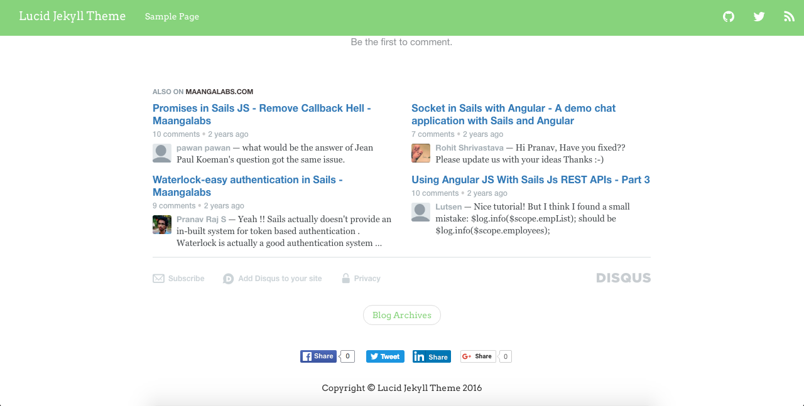
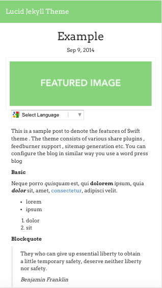

Limpid Jekyll Theme

Clone the repo to get started

Included :

 * Facebook/Twitter/LinkedIn/G+ Share
 * Disqus Integration
 * Prettify JS Code highlighter
 * Font Awesome
 * Author block and profile
 * Download source facility
 * Feature image on posts

# Desktop Preview

# Mobile Preview

If you are using this theme. Please update the wiki with your url.